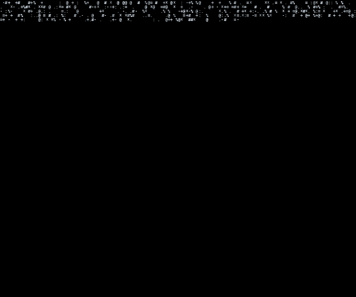

<div align="center">



<br/>

```
> SOC ANALYST  //  PENTESTER-IN-TRAINING  //  BUILDING QUIETLY
```

</div>

<br/>

### stack

`Splunk` `Wazuh` `Wireshark` `Burp Suite` `MITRE ATT&CK` `Kali`

### currently

- detection engineering, Windows event log analysis
- CySA+ prep alongside a 16-phase SOC learning path
- building tools nobody asked for, shipping them anyway

### builds

**TRACEX** — standalone Windows Event Log analyzer, 5 custom detection rules

<br/>

<div align="center">


</div>

</div>
